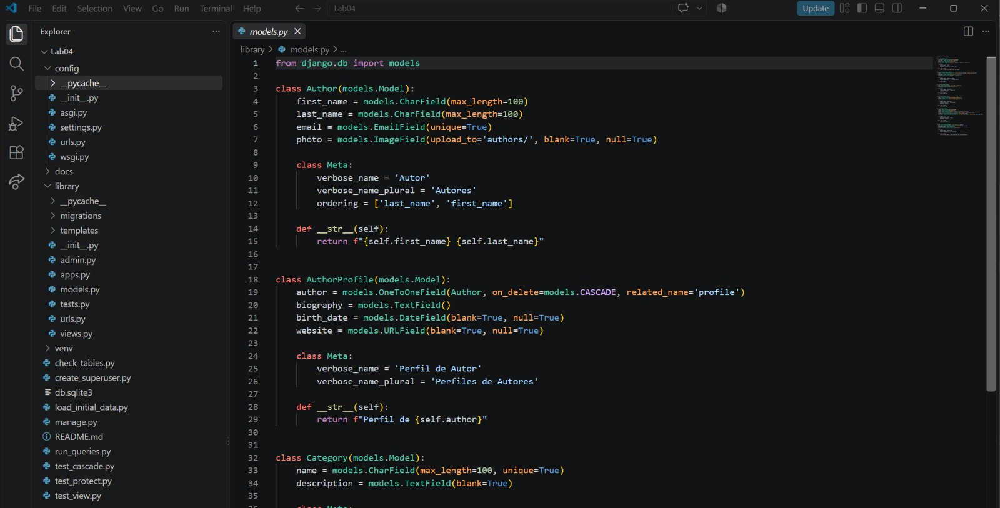
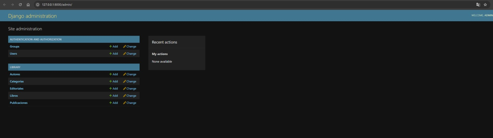
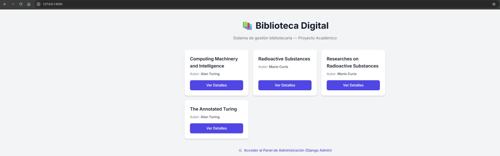
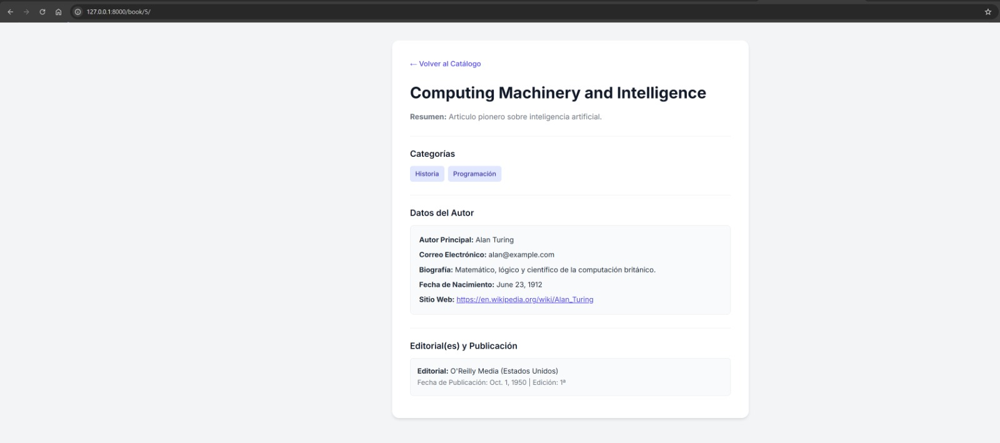
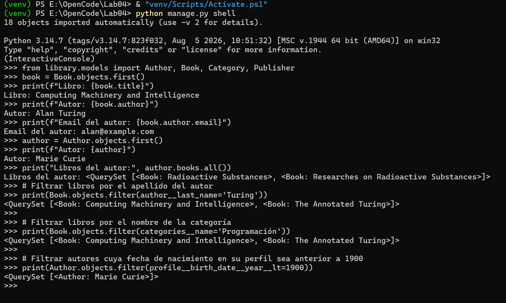

# Lab04: Sistema de Biblioteca en Django

Este repositorio contiene el desarrollo del proyecto de Django para la gestión de una biblioteca, cumpliendo rigurosamente con los estándares de arquitectura, relaciones de modelos, integridad referencial y convenciones de código.

---

## 📐 Modelo Relacional y Esquema de Relaciones

El diseño de la base de datos se compone de los siguientes modelos y relaciones:

1. **`Author` (Autor)**
   - Representa al autor principal de los libros.
   - Campos: `first_name`, `last_name`, `email`, `photo`.

2. **`AuthorProfile` (Perfil de Autor)**
   - Relacionado con `Author` mediante un **`OneToOneField`** (`on_delete=models.CASCADE`).
   - Propósito: Separar la información biográfica y detallada del registro principal del autor.
   - Campos: `biography`, `birth_date`, `website`.

3. **`Category` (Categoría)**
   - Representa las temáticas o géneros de los libros.
   - Campos: `name`, `description`.

4. **`Publisher` (Editorial)**
   - Representa a las editoriales que publican los libros.
   - Campos: `name`, `address`, `country`.

5. **`Book` (Libro)**
   - Entidad central conectada con:
     - **`Author`**: Relación **`ForeignKey`** con `on_delete=models.PROTECT` (y related_name `books`). Protege la integridad evitando que se borren autores que tienen libros publicados.
     - **`Category`**: Relación **`ManyToManyField`** (permite que un libro pertenezca a múltiples categorías y viceversa).
     - **`Publisher`**: Relación **`ManyToManyField`** a través del modelo intermedio personalizado **`Publication`**.

6. **`Publication` (Modelo Intermedio con `through`)**
   - Conecta `Book` y `Publisher` añadiendo atributos propios de la relación:
     - `publication_date` (Fecha específica en que esa editorial publicó la edición).
     - `edition` (Número de edición).

---

## 🔍 Observaciones y Decisiones de Diseño

1. **Uso de Singular en Modelos:**
   - Siguiendo las convenciones de Django y PEP 8, los nombres de las clases de los modelos están declinados en singular (`Author`, `Book`, `Publisher`, `Category`, `Publication`), reflejando una única entidad por instancia.

2. **Idioma:**
   - Todo el código fuente, nombres de variables, métodos, campos y comentarios se han escrito rigurosamente en **inglés**. Los entregables, explicaciones y documentación se presentan en **español**.

3. **Gestión de `on_delete`:**
   - Se evaluó el comportamiento de borrado:
     - **`CASCADE`**: Elimina en cascada los elementos dependientes (útil para perfiles o relaciones dependientes directas).
     - **`PROTECT`**: Impide la eliminación de un registro padre (ej. un Autor) si existen registros hijos dependientes (Libros), garantizando la integridad de los datos editoriales.

4. **Estructura Modular:**
   - El proyecto sigue la estructura estándar de Django con la aplicación `library` encapsulando la lógica de negocio y los modelos de dominio.

---

## 📸 Evidencias y Capturas del Proyecto

### 1. Estructura del Proyecto en el Editor
> 

### 2. Panel de Administración de Django (`/admin/`)
> 

### 3. Catálogo de Libros (Vista de Lista)
> 

### 4. Vista de Detalle del Libro
> 

### 5. Consultas ORM en la Consola de Django
> 
